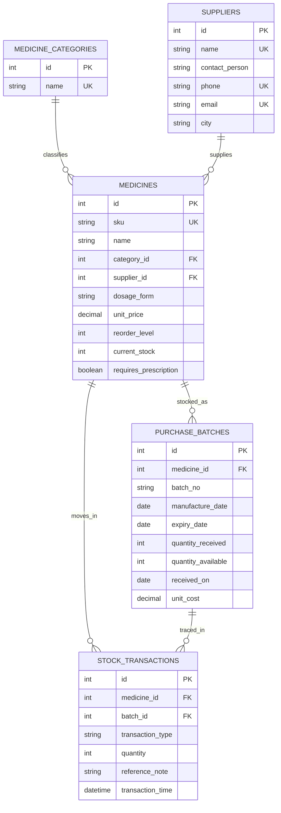

# Project Report

## Title
MediTrack Pharmacy Stock Management System

## 1. Problem Definition
Pharmacies and clinic stores must maintain accurate medicine inventory, supplier information, batch-wise stock, expiry dates, reorder thresholds, and dispensing records. Spreadsheet-driven workflows often lead to expired stock being missed, stock-outs during patient demand, duplicate supplier data, and inconsistent quantity balances. This project solves that real-world healthcare problem with a full-stack medicine stock management system backed by a relational database.

## 2. Objectives
- Maintain a centralized medicine master with supplier and category references
- Track stock batch-wise with manufacture dates, expiry dates, costs, and available units
- Receive and dispense stock using transaction-safe backend workflows
- Highlight low-stock and near-expiry items for operational decision-making
- Demonstrate practical DBMS concepts including constraints, normalization, views, triggers, and indexing

## 3. Technology Stack
- Front-end: HTML, CSS, JavaScript
- Backend: Python (`http.server`)
- Database: SQLite (relational DBMS equivalent)

## 4. ER Model


## 5. Relational Schema
- `medicine_categories(id, name)`
- `suppliers(id, name, contact_person, phone, email, city)`
- `medicines(id, sku, name, category_id, supplier_id, dosage_form, unit_price, reorder_level, current_stock, requires_prescription)`
- `purchase_batches(id, medicine_id, batch_no, manufacture_date, expiry_date, quantity_received, quantity_available, received_on, unit_cost)`
- `stock_transactions(id, medicine_id, batch_id, transaction_type, quantity, reference_note, transaction_time)`

## 6. Normalization
- The design is normalized up to **3NF**.
- Category and supplier details are separated from medicines to avoid repeating descriptive data for each medicine row.
- Batch-specific information is stored in `purchase_batches`, which prevents repeating expiry or cost information in the medicine master table.
- Transaction history is stored separately in `stock_transactions`, which avoids mixing operational events with current state data.
- Derived insights such as stock status and expiry monitoring are exposed through views instead of storing redundant summary columns.

## 7. DBMS Concepts Implemented

### DDL
- Tables with primary keys, foreign keys, unique constraints, and check constraints
- Indexes on medicine lookups, expiry date, and transaction filters
- Views for inventory visibility and expiry analysis
- Triggers for stock updates and batch validation

### DML
- Insert sample categories, suppliers, medicines, batches, and stock movement data
- Insert new medicines and suppliers from the front-end
- Record stock-in and stock-out operations

### Constraints and Data Integrity
- Unique constraints prevent duplicate SKU codes and supplier contact details
- Check constraints validate prices, quantities, and prescription flags
- Foreign keys preserve valid relationships between medicines, suppliers, categories, batches, and stock logs
- Batch date validation prevents expiry dates earlier than manufacture dates

### Transactions
- Stock receive and dispense operations are wrapped in backend transactions to keep medicine stock and batch balances consistent

### Indexing
- Indexes support faster medicine search, SKU lookup, expiry tracking, and movement history filtering

### Views
- `medicine_inventory_view` combines medicine, supplier, category, stock, and expiry information with a computed stock state
- `expiring_batches_view` shows active batches and calculated days remaining until expiry

### Triggers
- `trg_validate_batch_dates` blocks invalid batch entries
- `trg_after_batch_insert` automatically increases medicine stock and records a stock-in transaction

## 8. Important SQL Queries

### Find medicines at or below reorder level
```sql
SELECT name, current_stock, reorder_level
FROM medicines
WHERE current_stock <= reorder_level;
```

### Find batches expiring within 60 days
```sql
SELECT medicine_name, batch_no, expiry_date, days_to_expiry
FROM expiring_batches_view
WHERE days_to_expiry BETWEEN 0 AND 60;
```

### Find top dispensed medicines
```sql
SELECT m.name, SUM(st.quantity) AS total_dispensed
FROM stock_transactions st
JOIN medicines m ON m.id = st.medicine_id
WHERE st.transaction_type = 'OUT'
GROUP BY m.id
ORDER BY total_dispensed DESC;
```

## 9. Front-End Features
- Dashboard cards for medicine count, suppliers, stock units, low-stock items, and expiring batches
- Search and stock-state filter for medicines
- Supplier registration and medicine registration forms
- Batch receiving form and medicine dispensing form
- Transaction feed and top-dispensed analytics section
- Professional healthcare-inspired responsive UI

## 10. Backend Features
- REST-style API endpoints for dashboard, medicines, suppliers, and transactions
- Automatic database initialization and sample seeding
- Transaction-safe dispensing logic with batch-wise allocation
- Static file serving for the front-end

## 11. Practical Applicability
This system is useful for retail pharmacies, hospital pharmacies, medical stores, and clinics that need a reliable way to maintain medicine stock levels, avoid stock-outs, watch expiry-sensitive inventory, and keep a traceable audit trail of stock movement.

## 12. Conclusion
The MediTrack Pharmacy Stock Management System demonstrates a practical and meaningful full-stack DBMS application in the healthcare domain. It combines user-friendly front-end design, backend business rules, and relational database concepts such as schema design, normalization, constraints, indexing, triggers, views, and transaction management to solve a real inventory-control problem.
